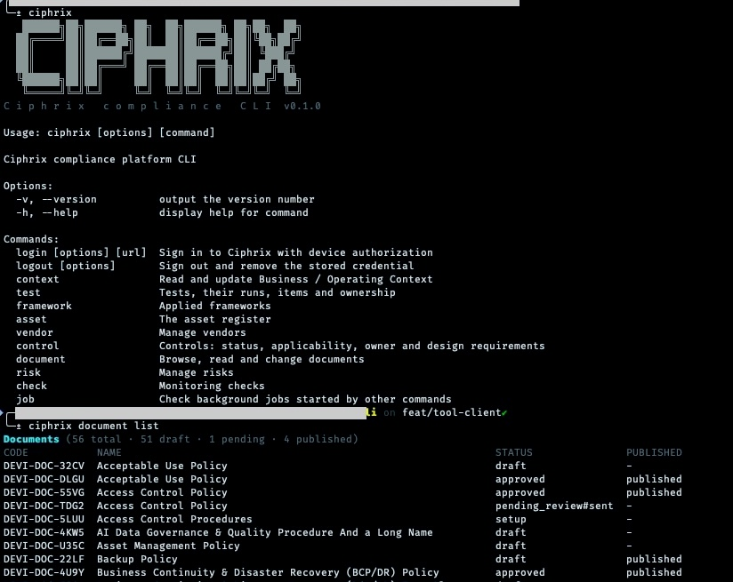
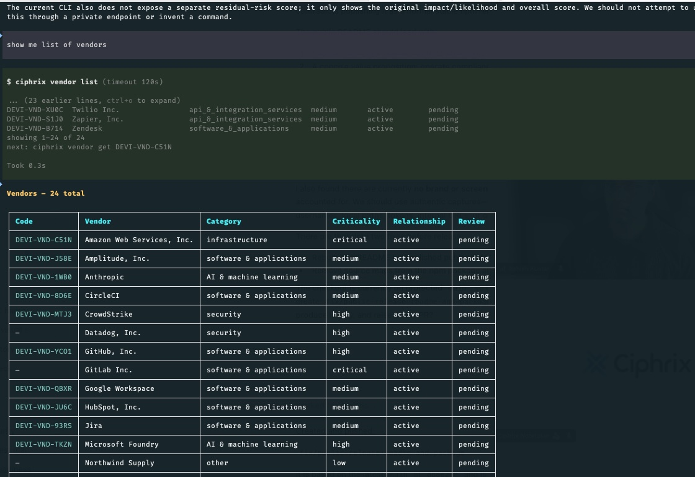
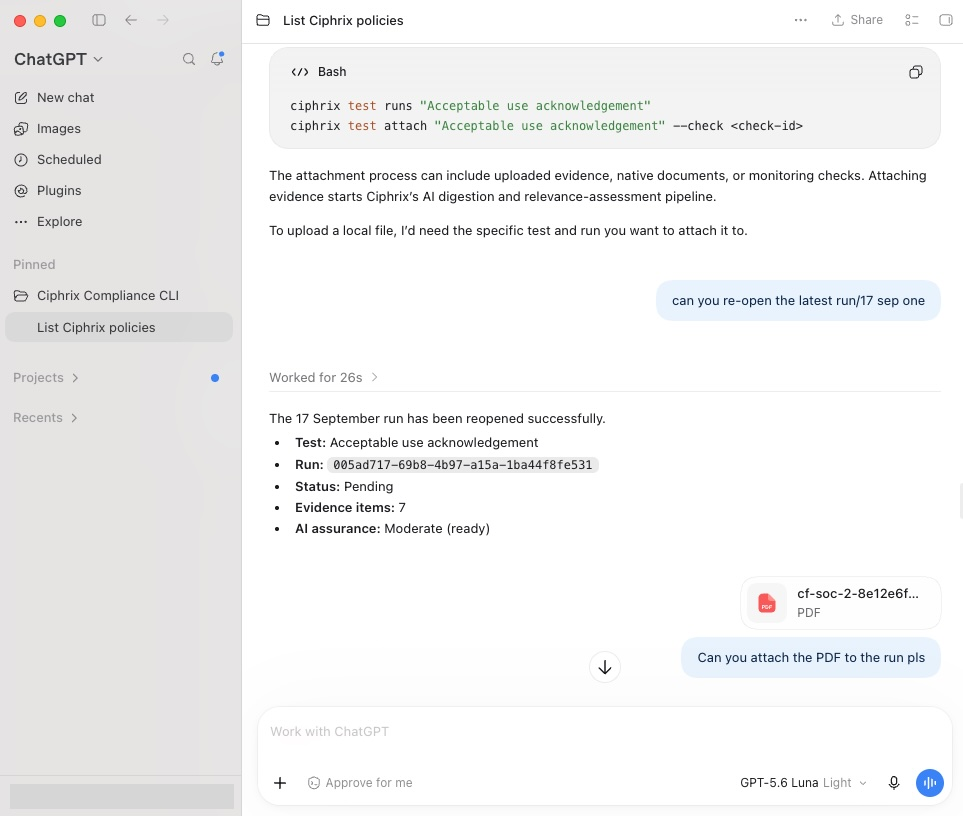
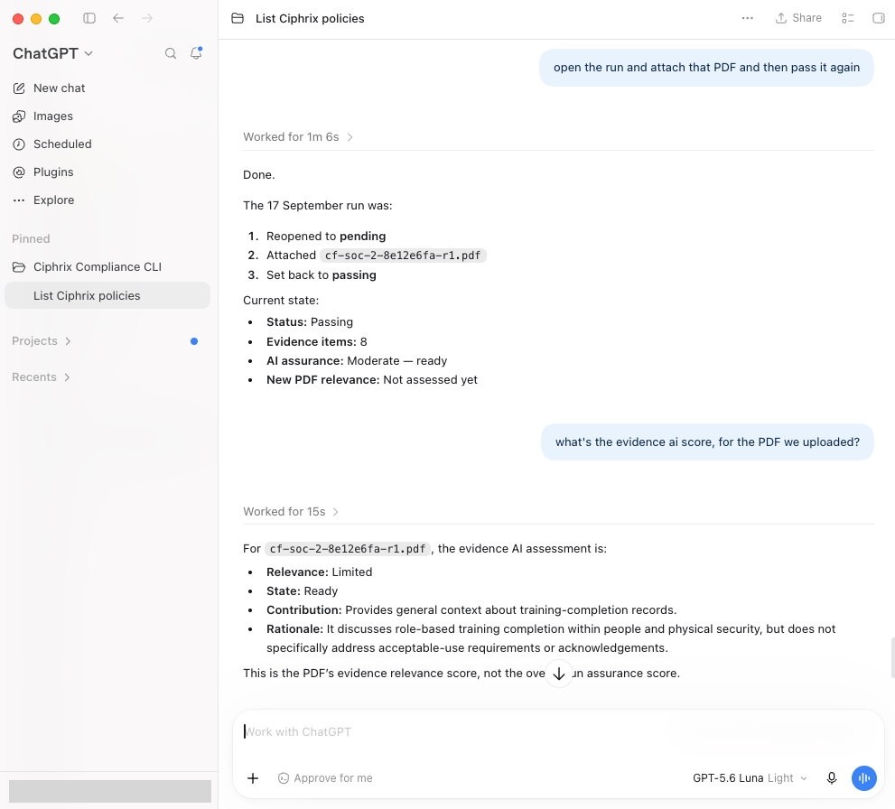

<p align="center">
  <picture>
    <source media="(prefers-color-scheme: dark)" srcset="assets/brand/logo_dark_mode.svg">
    <source media="(prefers-color-scheme: light)" srcset="assets/brand/logo_light_mode.svg">
    
  </picture>
</p>

<h1 align="center">Ciphrix CLI</h1>

<p align="center">
  Compliance work, wherever you and your agents work.
</p>

The official command-line interface for the [Ciphrix](https://ciphrix.com) compliance platform.
Use Ciphrix from your terminal, scripts, and agent workspaces to understand compliance context, work with
policies and evidence, run tests, and manage frameworks, controls, assets, vendors, risks, and monitoring.

## Install

Requires Node.js 20.19 or newer.

```bash
npm install --global @ciphrix/cli
ciphrix login
```

Or run a command without installing:

```bash
npx @ciphrix/cli --help
```

Update an existing global installation with `npm install --global @ciphrix/cli@latest`.

`ciphrix login` opens the Ciphrix authorization page in your browser and prints the same link and device
code in the terminal. Your password is never entered into the CLI.

<p align="center">
  
</p>

## From question to evidence

```bash
# Understand the organisation before changing anything
ciphrix context get business

# Find a policy and read it as Markdown
ciphrix document list
ciphrix document get "Access Control Policy"

# See what a test covers and inspect its history
ciphrix test links "MFA enforced"
ciphrix test runs "MFA enforced"

# Record a formal result
ciphrix test run result "MFA enforced" \
  --status passing \
  --note "Rolled out organisation-wide"
```

Add `--json` to any command for stable machine-readable output. Commands that perform consequential
changes show the proposed action and ask for confirmation; automation can opt in with `--yes`.

## One interface for compliance work

- **Understand the business** — read Business and Operating Context before proposing or changing controls.
- **Work with policies** — find documents, read Markdown, manage versions, and move work through review.
- **Connect evidence to assurance** — inspect tests and runs, attach evidence, and record formal results.
- **Navigate the compliance model** — trace frameworks, clauses, controls, tests, documents, and assets.
- **Manage operational registers** — work with assets, vendors, risks, treatments, ownership, and files.
- **Operate monitoring** — inspect checks, resources, runs, findings, integrations, and background jobs.

Names and stable Ciphrix codes are accepted throughout, so neither people nor agents need to work with
opaque database identifiers.

## Built for agent workspaces

Ciphrix ships an agent skill as well as a CLI. The CLI provides the tools; the skill teaches an agent the
Ciphrix domain model, operating principles, authority boundaries, and reliable workflows.

Install the skill with the open [Skills CLI](https://skills.sh/docs/cli):

```bash
# Choose detected agents and installation scope interactively
npx skills add CiphrixHQ/ciphrix-cli --skill ciphrix

# Or install globally for selected agents
npx skills add CiphrixHQ/ciphrix-cli --skill ciphrix \
  -g \
  -a codex \
  -a claude-code \
  -a cursor \
  -a opencode
```

The skill works with compatible agent harnesses including Codex, Claude Code, Cursor, and OpenCode. It
is also included in the npm package at [`skills/ciphrix/SKILL.md`](skills/ciphrix/SKILL.md). Installing
the npm package never modifies an agent's configuration directories.

Run `npx skills update` to update installed skills when a newer version is available.

### Ask in natural language, operate through the CLI

An agent can translate a request into a Ciphrix command, inspect the structured result, and present the
answer in the workspace where the user is already working.

<p align="center">
  
</p>

### Work with evidence from ChatGPT

The same command surface supports multi-step compliance work: inspect a run, reopen it, attach evidence,
return it to its intended state, and explain the resulting evidence assessment.

<table>
  <tr>
    <td width="50%" align="center">
      
    </td>
    <td width="50%" align="center">
      
    </td>
  </tr>
  <tr>
    <td align="center"><sub>Reopen the run and attach new evidence</sub></td>
    <td align="center"><sub>Confirm the result and understand evidence relevance</sub></td>
  </tr>
</table>

## Command surface

Run `ciphrix <resource> --help` for its actions and `ciphrix <resource> <action> --help` for the flags of
one command. Installed help is authoritative. The complete generated reference is available at
[`skills/ciphrix/references/commands.md`](skills/ciphrix/references/commands.md) and checked for drift in CI.

<details>
<summary>Browse the command groups</summary>

| Command                                            | What it does                                                                   |
| -------------------------------------------------- | ------------------------------------------------------------------------------ |
| `ciphrix login` · `logout`                         | Authorize this device or revoke its session.                                   |
| `ciphrix context get` · `status` · `set` · `reset` | Read and maintain Business and Operating Context.                              |
| `ciphrix document …`                               | Browse, read, create, edit, version, submit, approve, and delete documents.    |
| `ciphrix test …`                                   | Inspect tests, links, runs and evidence; attach items and record results.      |
| `ciphrix framework …`                              | Browse applied frameworks and work with clauses and mappings.                  |
| `ciphrix control …`                                | Inspect controls, ownership, applicability, design requirements, and mappings. |
| `ciphrix asset …`                                  | Maintain the asset register, mappings, and tags.                               |
| `ciphrix vendor …`                                 | Maintain vendors and their attached files.                                     |
| `ciphrix risk …`                                   | Maintain risks, treatment, scores, controls, and files.                        |
| `ciphrix check …`                                  | Operate monitoring checks, resources, runs, findings, and integrations.        |
| `ciphrix job status <jobId>`                       | Follow background work started by another command.                             |

</details>

## Safe by default

- Credentials use the operating system keychain by default and are isolated by API environment.
- Device authorization keeps passwords out of the terminal and CLI process.
- API traffic requires HTTPS unless insecure HTTP is explicitly enabled for local testing.
- Redirects are not followed for API calls or uploads.
- Destructive and consequential actions require confirmation unless `--yes` is explicitly supplied.
- JSON output is undecorated and suitable for programs and agents.
- Requests time out, responses are size-limited, and local evidence uploads reject symbolic links and
  files over 50 MiB.

Please report vulnerabilities privately as described in [SECURITY.md](SECURITY.md).

## Non-production and advanced configuration

The CLI does not use a general configuration file. An API base is selected in this order:

1. The command's `--api-url` option.
2. `CIPHRIX_API_URL`.
3. The built-in production API.

Credentials are stored separately for each API base, so local or test authentication does not replace
the production credential.

| Setting                                                      | Purpose                                                                                                                                       |
| ------------------------------------------------------------ | --------------------------------------------------------------------------------------------------------------------------------------------- |
| `--api-url <url>` / `CIPHRIX_API_URL`                        | Use a different API base, including its public API prefix.                                                                                    |
| `--allow-insecure-http` / `CIPHRIX_ALLOW_INSECURE_HTTP=true` | Explicitly permit HTTP for trusted local testing. Never use it across an untrusted network.                                                   |
| `CIPHRIX_CREDENTIAL_STORE=file`                              | Use a permission-restricted plaintext credential file for intentional headless or test environments. The keychain remains the normal default. |
| `ciphrix login --no-open`                                    | Print the authorization link without opening a browser.                                                                                       |
| `ciphrix logout --local-only`                                | Remove only this device's stored credential without contacting the API.                                                                       |
| `NO_COLOR` / `FORCE_COLOR`                                   | Apply standard terminal colour controls. Piped output is never coloured.                                                                      |

API URLs containing user information, query strings, or fragments are rejected. If remote logout fails,
the local credential is retained so revocation can be retried; `--local-only` is always an explicit choice.

## Contributing

See [CONTRIBUTING.md](CONTRIBUTING.md) and [AGENTS.md](AGENTS.md). `main` is always releasable, and every
change lands through a short-lived pull request with required review and automated checks.

## License

[Apache-2.0](LICENSE)
